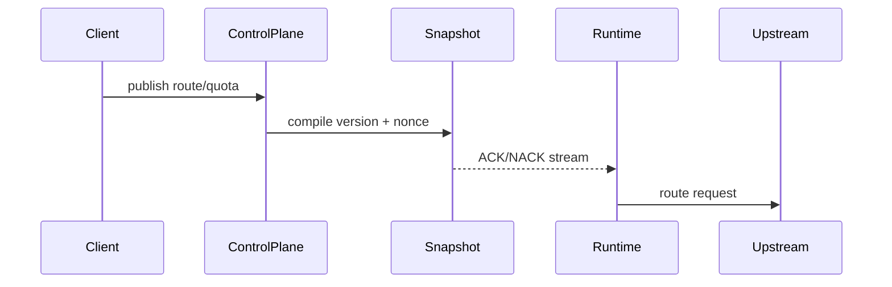
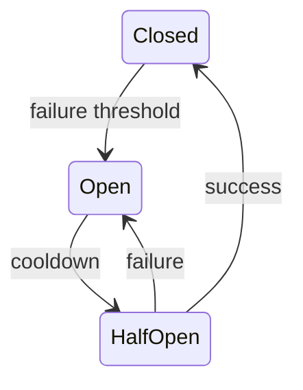

# Operations

```mermaid
sequenceDiagram
  Client->>ControlPlane: publish route/quota
  ControlPlane->>Snapshot: compile version + nonce
  Snapshot-->>Runtime: ACK/NACK stream
  Runtime->>Upstream: route request
```

```mermaid
stateDiagram-v2
  Closed --> Open: failure threshold
  Open --> HalfOpen: cooldown
  HalfOpen --> Closed: success
  HalfOpen --> Open: failure
```

SLO：控制面 API p99 < 200ms，快照编译失败时保留最后有效版本，限流必须 fail-safe。演练控制面分区、ACK/NACK 乱序、upstream 全故障、配额热点和故障实验过期；日志必须脱敏 Authorization、Cookie、Token 和 Secret。
